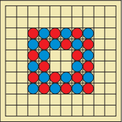
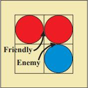
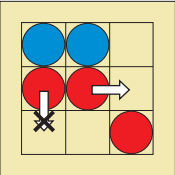

# PFL 2021 2022 - Tabalho Prático 2

## 1. Identificação do trabalho e do grupo

- Jogo: Jostle
- Turma: 7
- Grupo: Jostle_1

| Nome | Número | Contribuição |
| -- | -- | -- |
| Diogo André Barbosa Nunes | up201808546 | 50% |
| Margarida Alves Pinho | up201704599 | 50% |

Nota: Reparamos que as notas do primeiro trabalho estavam muito diferentes. No entanto, a diferença de empenho tinha sido ligeira e não achamos que se justifique as alterações na nota.  

## 2. Instalação e Execução
- Instalar e executar SICStus
- Consultar o ficheiro ```play.pl``` 
- Escrever ```play.```
- Jogar! :)

## 3. Descrição do Jogo
Jostle é um jogo para 2 jogadores que usa um tabuleiro 10x10 com 16 peças (já inicialmente dispostas no tabuleiro) para cada jogador (Azul e Vermelho). Cada jogada consiste em mover 1 das peças do próprio jogador e não é permitido passar. A primeira jogada pertence sempre ao jogador Vermelho.



O objetivo do jogo é ser o último jogador a realizar uma jogada válida. Quando um jogador tiver que jogar e não tiver movimentos possíveis de realizar, perde (não há empates nem captura de peças).

Para este jogo é importante esclarecer alguns conceitos para melhor entender o seu funcionamento:
- **Conexão**: existe quando 2 peças estão ortogonalmente adjacentes, quer sejam amigáveis (próprias peças) ou inimigas.
- **Conexão amigável**: conexão com uma peça amigável.
- **Conexão inimiga**: conexão com uma peça inimiga.



- **Valor de uma peça**: número de conexões amigáveis menos o número de conexões inimigas.


Agora que sabemos estes conceitos, podemos facilmente descrever os movimentos possíveis: uma peça só se pode mover para posições livres e ortogonalmente adjacentes, **desde que o seu valor aumente**. No exemplo seguinte, podemos notar que a peça Vermelha central pode ser movida para a direita, uma vez que aumenta o seu valor de 0 (1 conexão amigável e 1 conexão inimiga) para 1 (apenas 1 conexão amigável). Por outro lado, a peça Vermelha mais à esquerda não pode realizar o movimento descrito, pois manteria o seu valor: de 1 conexão de cada tipo passaria a ter 0 conexões, mantendo o valor de 0.



Assim sendo, cada peça poderá ter até 4 conexões. Existe uma variante deste jogo chamada "Hex Jostle", onde as principais diferenças são o tabuleiro hexagonal e o número máximo de conexões possíveis (6).

Ficam aqui 2 links com informação útil sobre Jostle:
- [Link Oficial](http://www.marksteeregames.com/Jostle_Go_rules.pdf)
- [Board Game Peek](https://boardgamegeek.com/boardgame/68808/jostle)

## 4. Lógica do Jogo

### 4.1. Representação interna do estado do jogo

O **tabuleiro** é representado por uma lista de listas, sendo cada lista uma linha do tabuleiro. Durante o jogo, cada elemento dessa lista pode ter 3 valores:
- ' ' representa uma posição vazia;
- 'A' representa uma posição ocupada por uma peça do jogador Azul;
- 'V' representa uma posição ocupada por uma peça do jogador Vermelho.

Todos os jogos começam com a mesma disposição de peças:
```prolog
[
    [' ',' ',' ',' ',' ',' ',' ',' ',' ',' '],
    [' ',' ',' ',' ',' ',' ',' ',' ',' ',' '],
    [' ',' ','V','A','V','A','V','A',' ',' '],
    [' ',' ','A','V','A','V','A','V',' ',' '],
    [' ',' ','V','A',' ',' ','V','A',' ',' '],
    [' ',' ','A','V',' ',' ','A','V',' ',' '],
    [' ',' ','V','A','V','A','V','A',' ',' '],
    [' ',' ','A','V','A','V','A','V',' ',' '],
    [' ',' ',' ',' ',' ',' ',' ',' ',' ',' '],
    [' ',' ',' ',' ',' ',' ',' ',' ',' ',' ']
]
```

Um possível estado intermédio de jogo é o seguinte:
```prolog
[
    [' ',' ',' ',' ',' ',' ',' ',' ',' ',' '],
    [' ',' ',' ',' ','V','V',' ',' ',' ',' '],
    [' ',' ',' ',' ','A','A','A',' ',' ',' '],
    ['A',' ','V','V',' ','V','A','V',' ',' '],
    [' ','V',' ','A','A','V','A','A',' ',' '],
    [' ',' ','A',' ','V','A',' ',' ','V',' '],
    [' ',' ','V',' ','V','V','V',' ',' ',' '],
    [' ','A',' ','A',' ',' ','A','A','V',' '],
    [' ',' ','V',' ','A',' ',' ',' ',' ',' '],
    [' ',' ',' ',' ',' ',' ',' ',' ',' ',' ']
]
```

Um possível estado final de jogo, em que o jogador Azul não consegue realizar nenhuma jogada válida (sendo o vencedor o jogador Vermelho), é o seguinte:
```prolog
[
    [' ',' ',' ',' ',' ',' ',' ',' ',' ',' '],
    [' ',' ',' ',' ','V','V',' ',' ',' ',' '],
    [' ',' ',' ',' ','A','A','A',' ',' ',' '],
    ['A',' ','V','V',' ','V','A',' ','V',' '],
    [' ','V',' ','A','A','V','A',' ',' ',' '],
    [' ',' ','A',' ','V',' ','A','A',' ',' '],
    [' ',' ',' ','V','V','V','V',' ','V',' '],
    [' ','A','A',' ',' ',' ','A','A','V',' '],
    [' ',' ','V',' ','A',' ',' ',' ',' ',' '],
    [' ',' ',' ',' ',' ',' ',' ',' ',' ',' ']
]
```

### 4.2. Visualização do estado de jogo
O predicado de visualização do jogo é display_game(Board-Player-ValueA-ValueV), que por sua vez chama display_value para os 2 jogadores, display_board(Board) e display_player(Player).

Nos predicados display_value dos 2 jogadores, apenas é impresso na consola do SICStus o valor do estado do jogo para os 2 jogadores, tal como está explicado mais à frente na secção 4.6 deste relatório.

No predicado display_board, imprimimos o tabuleiro com as letras e números a identificar, respetivamente, as colunas e as linhas do mesmo.

No predicado display_player, apenas enunciamos qual o jogador a realizar a jogada nesse momento.

### 4.3. Execução de Jogadas
O predicado de execução de jogada é move(+GameState, +Move, -NewGameState). GameState é constituído pelo Board e o Player atual, Move é constituído pela coluna, linha e direção do movimento que pretendemos fazer e NewGameState é o novo tabuleiro após a jogada ser efetuada e o jogador seguinte.

Dentro deste predicado, verificamos que a célula-escolhida pertence ao jogador, que a célula-destino está livre e que a jogada é válida, isto é, que o valor dessa peça aumenta. Caso isto não aconteça, a jogada não é realizada e é pedido um novo input ao mesmo jogador.

### 4.4. Final do Jogo
Para verificar o final do jogo e anunciar o vencedor, nós usamos o predicado game_over(+Board, +Player). Como o jogo só acaba quando um jogador não consegue realizar nenhuma jogada válida (esse jogador é o que perde o jogo), antes de voltar ao início do ciclo de jogo, verificamos se existem ainda jogadas válidas para o jogador seguinte, chamando valid_moves, como vai ser explicado na secção seguinte. Se existirem, o ciclo continua; caso contrário, é apresentado o tabuleiro final e é enunciado o vencedor do jogo.

### 4.5. Lista de jogadas válidas
O predicado valid_moves(+GameState, -ListOfMoves) vai criar em ListOfMoves uma lista de listas com as jogadas que ainda são possíveis realizar pelo próximo jogador. GameState é constituído pelo Board e pelo Player e este predicado chama outro predicado (get_valid_plays) que vai percorrer todo o tabuleiro e colocar em ListOfMoves todas as jogadas que forem possíveis para o respetivo jogador. Cada lista de jogada possível é constituída por coluna, linha e direção do movimento que se pode realizar. Desta forma, uma mesma peça pode ter no máximo 4 movimentos possíveis, pelo que esta lista não enuncia apenas as peças que podem ser jogadas, mas também quais movimentos podem ser feitos. 

### 4.6. Avaliação do Estado do Jogo (extra)
A nossa melhor forma de avaliar o estado do jogo do ponto de vista de um jogador é, na nossa opinião, o número de jogadas possíveis que esse jogador pode fazer. Achamos ser a melhor forma de avaliação, uma vez que quanto menos jogadas possíveis um jogador tiver, mais próximo está de perder o jogo.

Desta forma, o nosso predicado value(+GameState, +Player, -Value) vai basicamente buscar o tamanho da lista de jogadas válidas do Player. O valor do estado do jogo para ambos os jogadores está indicado mesmo antes do tabuleiro de jogo (em cada jogada). O valor de ambos os jogadores é calculado assim que um novo ciclo de jogo começa (ou seja, que o jogador seguinte ainda tem jogadas possíveis) e apresentado ainda antes do estado do jogo, como já foi dito.

### 4.7. Jogada do Computador (extra)
Nesta secção, temos a realçar que o nosso computador apenas realiza jogadas aleatórias. Contudo, decidimos manter a sintaxe pedida neste ponto, em que o segundo argumento do predicado choose_move(+GameState, +Level, -Move) é sempre 1 (jogada aleatória). 

Desta forma, o nosso predicado de escolha de jogada do computador vai buscar todas as jogadas válidas e escolhe uma aleatoriamente (usando a função random_member da biblioteca "random").

## Conclusões
Neste projeto passamos por algumas dificuldades, entre elas decidir como representar as peças do jogo, o tabuleiro em si e se a nossa escolha possibilitava mostrar de forma evidente um tabuleiro 10x10. Por erro nosso, começámos por implementar o código não pela ordem aconselhada no enunciado e sem os nomes dos predicados como eram pedidos, o que nos levou a ter que fazer uma revisão de todo o código mais perto da entrega para reajustar o nome dos predicados.

Como melhorias possíveis, temos:
- a possibilidade de criar níveis de dificuldade para o computador (visto que no nosso projeto temos apenas a escolha de uma jogada aleatória);
- a implementação da variação do Jostle para um tabuleiro hexagonal, onde as principais diferenças seriam o número de conexões de cada peça (aumentaria de 4 para 6) e a forma como mostraríamos o tabuleiro na consola do SICStus.

Tendo em conta as dificuldades passadas e tendo em conta as possíveis melhorias a aplicar neste projeto, concluímos que conseguimos implementar o jogo de tabuleiro Jostle em linguagem Prolog com todas as regras e objetivos e modos de jogo a que nos propusemos.

## Bibliografia

- [Documentação do SICStus](https://sicstus.sics.se/sicstus/docs/latest4/html/sicstus.html/)
- [Regras Oficiais](http://www.marksteeregames.com/Jostle_Go_rules.pdf)
- [Jostle - BoardGameGeek](https://boardgamegeek.com/boardgame/68808/jostle)
- [Página Moodle de PFL](https://moodle.up.pt/course/view.php?id=4031)